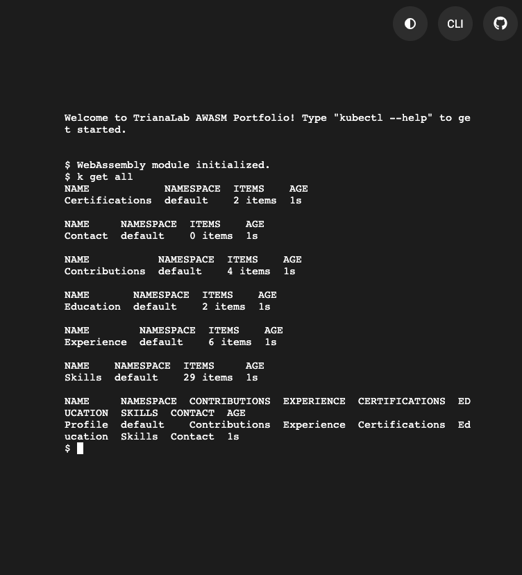
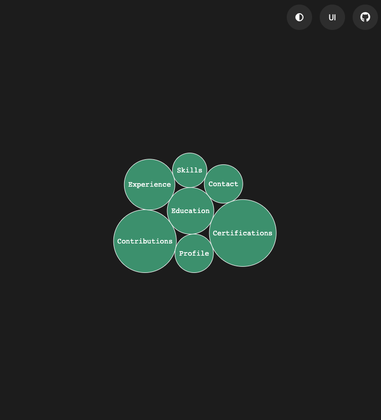

# AWASM Portfolio

This project is a WebAssembly (WASM) powered portfolio application designed to emulate a console, allowing users to interact with the developer's resume using Kubernetes-like commands. The application leverages a unique architecture where both the frontend and backend reside on the client side, communicating through messages via Web Workers.

## Architecture Overview

### Frontend
- The frontend provides an interactive interface where users can execute commands and view data. It communicates with the backend via Web Workers, ensuring smooth interaction and data consistency.
- There are two primary modes for user interaction:
  1. **CLI Mode**:
     - Uses `xterm.js` to emulate a web terminal.
     - Includes `kubectl` commands to allow interaction with the virtual cluster.
   
  2. **UI Mode**:
     - Displays data in a visual, physics-based bubble interface.
     - Provides a modern, interactive visualization of the CV data.
   

Both modes interact with the same WebAssembly backend instance, ensuring that any actions performed in one mode are instantly reflected in the other.

### Backend
The backend is entirely implemented in Go and compiled in WebAssembly, running within the browser. It processes commands, manages data, and serves responses to the frontend. It is composed of several structured layers:

1. **Cmd Package**:
   - Uses Cobra for command parsing and validation.
   - Routes valid commands to the services package.

2. **Services Package**:
   - Contains the business logic for processing commands.
   - Ensures data consistency and handles interactions between layers.

3. **Repository Package**:
   - Manages a key-value store for CRUD operations.
   - Acts as the in-memory storage layer for the application.

4. **Factory Package**:
   - Generates valid resources with randomized data using `gofakeit`.
   - Simplifies the creation of mock data for user testing.

5. **Models Package**:
   - Defines data models to emulate Kubernetes Custom Resource Definitions (CRDs).
   - Represents various CV elements as structured resources.

6. **Preload Package**:
   - Preloads initial data to be displayed in the app.
   - Ensures the application is functional with meaningful data on startup.

7. **UI Package**:
   - Provides data serialization into YAML, JSON, or table formats.
   - Enables consistent display of information across CLI and UI modes.

8. **Util Package**:
   - Handles resource normalization and other utility tasks.
   - Ensures smooth data handling and consistency.

## Key Features
- **Integrated Architecture**: Both frontend and backend run entirely on the client side, leveraging WebAssembly for high performance and offline availability.
- **Two Modes of Interaction**: Switch seamlessly between CLI mode and UI mode, both of which reflect real-time updates.
- **Kubernetes-Inspired Design**: Use familiar `kubectl`-like commands to interact with the CV.
- **Rich Visualization**: Display data dynamically with a physics-based bubble interface.
- **Customizability**: Extensible data models and factory-generated resources make it easy to adapt for different use cases.

## Getting Started
1. Clone the repository.
2. Install dependencies and build the WASM package.
3. Serve the application and access it via the browser.
4. Interact with the portfolio using the terminal or the UI mode.

## Contributing
Contributions are welcome! Feel free to open an issue or submit a pull request with your suggestions or fixes.
