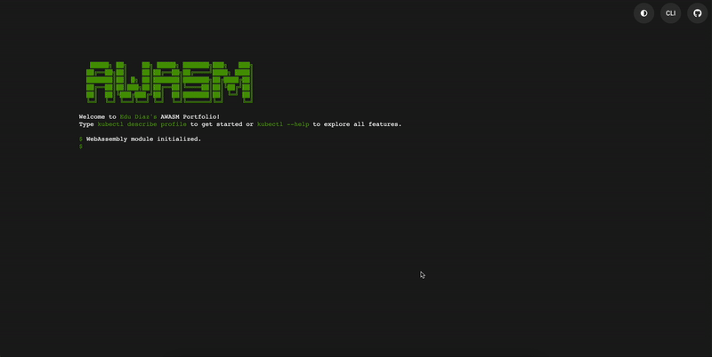
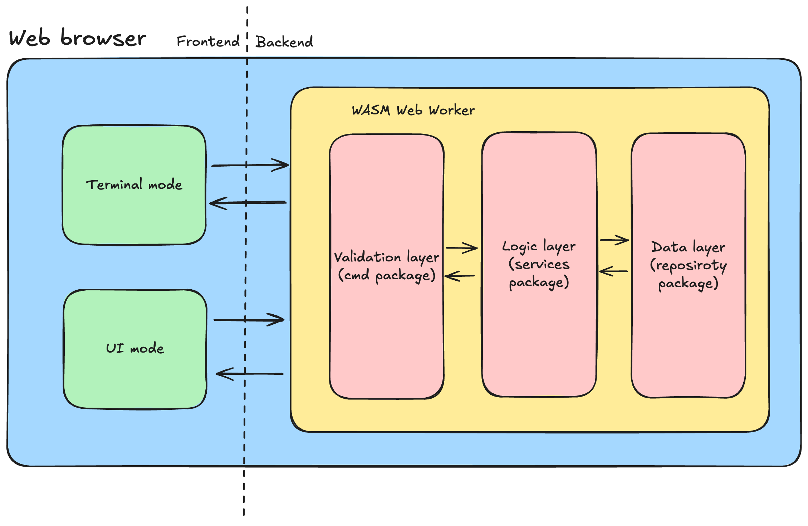

# AWASM Portfolio

    

AWASM Portfolio is a WebAssembly-powered application that emulates a console, enabling users to interact with the developer's resume using Kubernetes-like commands. This innovative client-side architecture combines frontend and backend functionality for seamless and dynamic user interactions.



But you can also check the live demo [here](https://trianalab.github.io/awasm-portfolio/).

## Deployment

1. **Locally**: Use the provided Makefile:
   ```bash
   make run
   ```
   Access the application at `http://127.0.0.1:8000`.

2. **Docker**: Pull and run the latest release image:
   ```bash
   docker run -p 8000:80 ghcr.io/trianalab/awasm-portfolio:$(curl -s https://api.github.com/repos/trianalab/awasm-portfolio/releases/latest | jq -r .tag_name)
   ```
   Access the application at `http://127.0.0.1:8000`.

## Customization

You can personalize the content displayed in your portfolio by editing the [`preload.go`](internal/preload/preload.go) file. It contains the data that initializes your portfolio profile such as certifications, contact details, contributions, education, work experience and skills.

### Steps to Customize

1. **Locate the File**:  
   Open the [`internal/preload/preload.go`](internal/preload/preload.go) file in your favorite code editor.

2. **Understand the Structure**:  
   The file uses Go structs to define and organize portfolio data. Each section (e.g., Certifications, Education) is represented by a struct that includes relevant fields. For example:

   - Certifications:
     ```go
     Certifications: []types.Certification{
         {
             Description: "Certified Kubernetes Administrator",
             Link:        "https://www.credly.com/badges/f1c5619d-f6a1-4988-8393-5f9a21455736/linked_in_profile",
         },
     },
     ```

   - Contact Information:
     ```go
     contact := &types.Contact{
         Email:     "edudiazasencio@gmail.com",
         Linkedin:  "https://www.linkedin.com/in/eduardo-diaz-asencio/",
         Github:    "https://github.com/edu-diaz",
     }
     ```

3. **Edit the Content**:  
   Modify the fields to match your personal details. For example:
   - Replace `"edudiazasencio@gmail.com"` with your email.
   - Update `"Certified Kubernetes Administrator"` with your certifications.

4. **Add or Remove Sections**:  
   - To add new certifications, append them to the `Certifications` array:
     ```go
     Certifications: []types.Certification{
         {
             Description: "Your New Certification",
             Link:        "https://link-to-your-certification",
         },
     },
     ```
   - To remove a section (e.g., Contributions), simply delete or comment out the relevant block of code.

5. **Save and Rebuild**:  
   After making changes, save the file and rebuild the project to see your updates in the portfolio.


## Architecture Overview



### Frontend
The frontend features two primary modes of interaction, both synchronized with the WebAssembly backend:

1. **CLI Mode**  
   - Emulates a web terminal using xterm.js.  
   - Supports `kubectl` commands to interact with a virtual cluster.

2. **UI Mode**  
   - Displays data as interactive, physics-based bubbles.  
   - Offers a dynamic, modern visualization of CV information.

### Backend
The backend, written in Go and compiled to WebAssembly, runs entirely within the browser. It processes commands and manages data using a layered architecture:

- **Cmd Package**: Handles command parsing (via Cobra) and validation.  
- **Services Package**: Implements business logic and data processing.  
- **Repository Package**: Manages an in-memory key-value store.  
- **Factory Package**: Creates mock resources with randomized data (using gofakeit).  
- **Models Package**: Defines Kubernetes-like CRD models for CV elements.  
- **Preload Package**: Loads initial CV data for immediate use.  
- **UI Package**: Serializes data into YAML, JSON, or tables for consistent display.  
- **Util Package**: Ensures data normalization and utility operations.  

## Key Features
- **Integrated Architecture**: Entirely client-side for high performance and offline capability.  
- **Dual Interaction Modes**: Switch between CLI and UI modes with real-time synchronization.  
- **Kubernetes-Inspired Commands**: Use familiar `kubectl` syntax to explore the CV.  
- **Dynamic Visuals**: Physics-based UI for engaging data visualization.  
- **Extensibility**: Easily customizable models and data generation. 

## Contributing
Contributions are welcome! Open an issue or submit a pull request to share your ideas or fixes.

## Acknowledgments

This project uses several open-source libraries and resources. We thank the developers of these projects for their contributions.
For a full list of dependencies, their licenses, and acknowledgments, please see the [NOTICE.md](./NOTICE.md) file.
