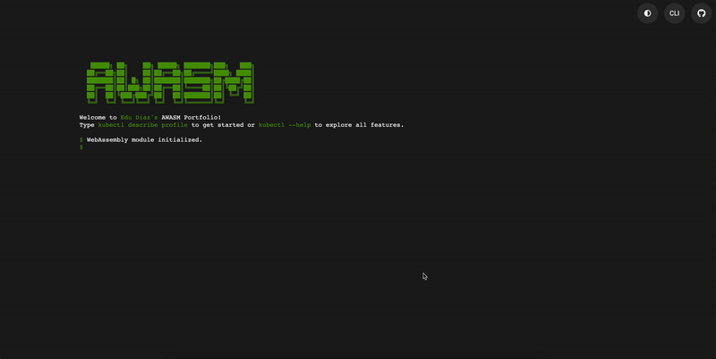

# AWASM Portfolio :rocket:

[](https://github.com/TrianaLab/awasm-portfolio/actions/workflows/ci.yml)
[](https://pkg.go.dev/github.com/TrianaLab/awasm-portfolio)
[](https://goreportcard.com/report/github.com/TrianaLab/awasm-portfolio)
[](https://codecov.io/github/TrianaLab/awasm-portfolio)
[](https://github.com/TrianaLab/awasm-portfolio/releases/latest)
[](LICENSE)

AWASM Portfolio is a WebAssembly-powered application that emulates a console, letting visitors interact with the developer's resume using `kubectl`-style commands. The data layer follows the [JSON Resume Schema](https://jsonresume.org/schema). The whole thing runs client-side: Go compiled to WASM in a Web Worker for the command engine, Svelte 5 for the UI, pdfmake for runtime PDF generation.



Try it live at [edudiaz.dev](https://edudiaz.dev) :globe_with_meridians:.

## Architecture :building_construction:

```
┌─────────────────────────────────────────────────────────────────┐
│                       Browser (single page)                     │
│  ┌──────────────┐     ┌──────────────┐     ┌─────────────────┐  │
│  │ Terminal     │     │ Resume view  │     │ Download PDF    │  │
│  │ (@xterm/xterm│     │ (Svelte 5    │     │ (pdfmake, in    │  │
│  │  + runes)    │     │  components) │     │  the browser)   │  │
│  └──────┬───────┘     └──────┬───────┘     └────────┬────────┘  │
│         │                    │                      │           │
│         └────────────┬───────┴──────────────────────┘           │
│                     │  runCommand() / fetchResume()             │
│                     ▼                                           │
│           ┌──────────────────┐                                  │
│           │  Web Worker      │                                  │
│           │   ├─ wasm_exec.js│                                  │
│           │   └─ app.wasm    │  Go (kubectl, repository,        │
│           └──────────────────┘  preload data, formatter)        │
└─────────────────────────────────────────────────────────────────┘
```

- **Go side** (`cmd/`, `internal/`): the kubectl-style command surface, in-memory repository, output formatters. Compiled to WebAssembly.
- **Frontend** (`frontend/`): Svelte 5 + Vite + TypeScript SPA. Renders the terminal and the resume view, talks to the Go core through a typed Worker bridge.
- **PDF**: when the user clicks the download button, `frontend/src/lib/pdf.ts` maps the same JSON Resume to a pdfmake document and triggers the download. Text in the PDF is vector (selectable / searchable / ATS-parseable).

## Run it locally :computer:

You need Go 1.26+, Node 22+, and `make`.

```bash
# One-shot production build (Go WASM + Svelte bundle)
make build && make run    # serves http://127.0.0.1:8000

# Or, with HMR for the frontend
make dev                  # builds WASM once, then runs vite dev server
```

Run it as a container instead:

```bash
docker run -p 8000:80 ghcr.io/trianalab/awasm-portfolio:$(curl -s https://api.github.com/repos/trianalab/awasm-portfolio/releases/latest | jq -r .tag_name)
```

## Customize :wrench:

To change the portfolio content, edit [`internal/preload/preload.go`](internal/preload/preload.go) — the per-section `build*` helpers are small typed slices. To change the UI, edit the Svelte components under [`frontend/src/components/`](frontend/src/components/).

After either change, `make build` regenerates everything end-to-end.

## Key features :key:

- **Fully client-side** — no backend, no auth, deploys as a static site.
- **kubectl-style CLI** — `kubectl get`, `describe`, `create`, `delete` against an in-memory resume "cluster".
- **Modern UI** — Svelte 5 runes, theme-aware, responsive.
- **PDF on the fly** — click the download button to get a vector PDF generated in the browser from the same JSON.
- **Schema-compliant data** — the JSON shape matches the JSON Resume v1 spec.
- **100% Go coverage**, gocyclo ≤ 15, golangci-lint clean.

## Contributing :handshake:

See [CONTRIBUTING.md](CONTRIBUTING.md) for the dev workflow, CI gates, and conventional-commit release flow. PRs welcome.

## Acknowledgments :pray:

This project uses several open-source libraries. Full list and their licenses: [NOTICE.md](./NOTICE.md).
