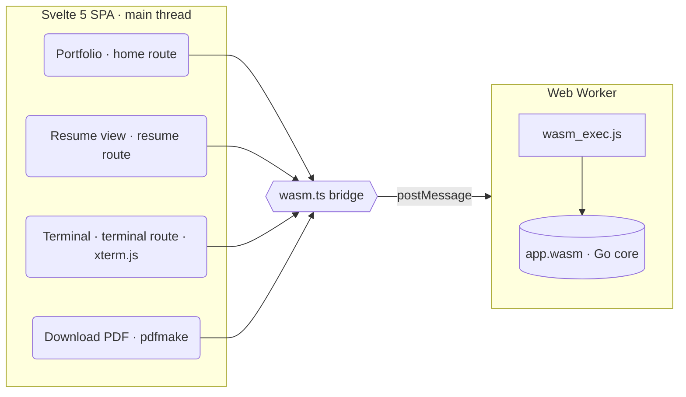

# AWASM Portfolio :rocket:

[](https://github.com/TrianaLab/awasm-portfolio/actions/workflows/ci.yml)
[](https://pkg.go.dev/github.com/TrianaLab/awasm-portfolio)
[](https://codecov.io/github/TrianaLab/awasm-portfolio)
[](https://github.com/TrianaLab/awasm-portfolio/releases/latest)
[](LICENSE)

AWASM Portfolio is a WebAssembly-powered engineering portfolio. The landing page reads as a normal portfolio; behind `#/terminal` the same content is served by a `kubectl`-style console, so visitors can query the resume as if it were a cluster. The data layer follows the [JSON Resume Schema](https://jsonresume.org/schema). The whole thing runs client-side: Go compiled to WASM in a Web Worker for the command engine, Svelte 5 for the UI, pdfmake for runtime PDF generation.

Try it live at [edudiaz.dev](https://edudiaz.dev) :globe_with_meridians:.

## Architecture :building_construction:


```mermaid
flowchart LR
    subgraph SPA [Svelte 5 SPA · main thread]
        direction TB
        Home(Portfolio · home route)
        Resume(Resume view · resume route)
        Term(Terminal · terminal route · xterm.js)
        PDF(Download PDF · pdfmake)
    end

    Bridge{{wasm.ts bridge}}

    subgraph Worker [Web Worker]
        direction TB
        Exec[wasm_exec.js]
        Wasm[(app.wasm · Go core)]
        Exec --> Wasm
    end

    Home --> Bridge
    Resume --> Bridge
    Term --> Bridge
    PDF --> Bridge
    Bridge -- postMessage --> Worker
```

- **Go side** (`cmd/`, `internal/`): the kubectl-style command surface, in-memory repository, output formatters. Compiled to WebAssembly.
- **Frontend** (`frontend/`): Svelte 5 + Vite + TypeScript SPA. Three hash routes — the portfolio (`#/`, with `#/work`, `#/experience` and `#/about` as in-page anchors), the resume (`#/resume`) and the terminal (`#/terminal`, lazy-loaded) — all fed by the same document through a typed Worker bridge.
- **Presentation vs. facts**: [`frontend/src/lib/portfolio.ts`](frontend/src/lib/portfolio.ts) holds navigation, featured-project selection and editorial copy; it references resume entries by their canonical `url` and never copies a fact. [`frontend/src/lib/resume-select.ts`](frontend/src/lib/resume-select.ts) combines the two into the view models the components render.
- **PDF**: when the user clicks the download button, `frontend/src/lib/pdf.ts` maps the same JSON Resume to a pdfmake document and triggers the download. Text in the PDF is vector (selectable / searchable / ATS-parseable).

## Run it locally :computer:

You need Go 1.26+, Node 22+, and `make`.

```bash
# One-shot production build (Go WASM + Svelte bundle)
make build && make run    # serves http://127.0.0.1:8000

# Or, with HMR for the frontend
make dev                  # builds WASM once, then runs vite dev server
```

Run it as a container instead:

```bash
docker run -p 8000:80 ghcr.io/trianalab/awasm-portfolio:$(curl -s https://api.github.com/repos/trianalab/awasm-portfolio/releases/latest | jq -r .tag_name)
```

## Customize :wrench:

There are three things you can customize without forking the codebase:

**1. Portfolio content** — edit [`internal/preload/preload.go`](internal/preload/preload.go). The per-section `build*` helpers are small typed slices (work, education, volunteer, skills, …). Saving + `make build` regenerates the WASM.

**2. Branding** — branding strings (the domain shown in the topbar, the page tab title, the GitHub repo card target) are driven by Vite environment variables. Copy [`frontend/.env.example`](frontend/.env.example) to `frontend/.env.local` and edit the values:

```bash
cp frontend/.env.example frontend/.env.local
# then edit frontend/.env.local
```

| Variable           | Default                     | Used by                                                                       |
| ------------------ | --------------------------- | ----------------------------------------------------------------------------- |
| `VITE_DOMAIN`      | `edudiaz.dev`               | Brand mark in the topbar (`~/{VITE_DOMAIN}`) and the fallback page `<title>`  |
| `VITE_GITHUB_REPO` | `TrianaLab/awasm-portfolio` | Footer repo card (release tag + stars + forks via GitHub REST API)            |

Once the resume loads, the page `<title>` is rebuilt from `basics.name` and the current role.

The defaults match the upstream demo. Override them at build time:

```bash
VITE_DOMAIN=alice.dev VITE_GITHUB_REPO=alice/portfolio make ui
```

**3. UI** — edit the Svelte components under [`frontend/src/components/`](frontend/src/components/), and the presentation model in [`frontend/src/lib/portfolio.ts`](frontend/src/lib/portfolio.ts) for navigation, the featured project and the suggested terminal commands. `make dev` gives you HMR while editing.

After any change, `make build` regenerates everything end-to-end.

## Key features :key:

- **Fully client-side** — no backend, no auth, deploys as a static site.
- **kubectl-style CLI** — `kubectl get`, `describe`, `create`, `delete` against an in-memory resume "cluster".
- **Modern UI** — Svelte 5 runes, light/dark themes, responsive, keyboard-accessible, reduced-motion aware.
- **PDF on the fly** — click the download button to get a vector PDF generated in the browser from the same JSON.
- **Schema-compliant data** — the resume validates against the official [`@jsonresume/schema`](https://www.npmjs.com/package/@jsonresume/schema) package in CI (`frontend/src/lib/resume-schema.test.ts`), so it stays usable with standard JSON Resume tooling and third-party themes.
- **100% Go coverage**, gocyclo ≤ 15, golangci-lint clean.

## Contributing :handshake:

See [CONTRIBUTING.md](CONTRIBUTING.md) for the dev workflow, CI gates, and conventional-commit release flow. PRs welcome.

## Acknowledgments :pray:

This project uses several open-source libraries. Full list and their licenses: [NOTICE.md](./NOTICE.md).
