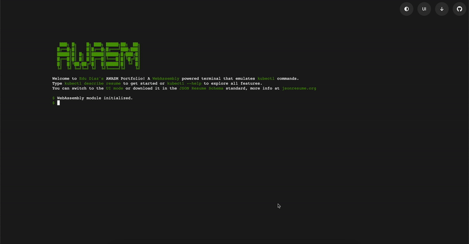

# AWASM Portfolio :rocket:

[](https://github.com/trianalab/awasm-portfolio) [](https://github.com/trianalab/awasm-portfolio/releases/latest) [](https://github.com/trianalab/awasm-portfolio/blob/main/LICENSE)

AWASM Portfolio is a WebAssembly-powered application that emulates a console, enabling users to interact with the developer's resume using Kubernetes-like commands. This innovative client-side architecture combines frontend and backend functionality for seamless and dynamic user interactions. The data structure follows the [JSON Resume Schema](https://jsonresume.org/schema) standard.



Check out the live demo [here](https://edudiaz.dev) :globe_with_meridians:.

## Deployment :computer:

1.  **Locally**: Use the provided Makefile:
    ```bash
    make run
    ```
    Access the application at `http://127.0.0.1:8000`.

2.  **Docker**: Pull and run the latest release image:
    ```bash
    docker run -p 8000:80 ghcr.io/trianalab/awasm-portfolio:$(curl -s https://api.github.com/repos/trianalab/awasm-portfolio/releases/latest | jq -r .tag_name)
    ```
    Access the application at `http://127.0.0.1:8000`.

## Customization :wrench:

Personalize your portfolio by editing the [`preload.go`](internal/preload/preload.go) file. This file contains the data that initializes your portfolio profile, including basics, work experience, certificates, education, skills, and more.

### Steps to Customize

1.  **Locate the File**: :file_folder:  
    Open the [`internal/preload/preload.go`](internal/preload/preload.go) file in your favorite code editor.

2.  **Understand the Structure**: :eyes:  
    The file uses Go structs to define and organize portfolio data. Each section (e.g., Certificate, Education) is represented by a struct that includes relevant fields.

3.  **Edit the Content**: :pencil2:  
    Modify the fields to match your personal details. For example:

    *   Replace `"edudiazasencio@gmail.com"` with your email.
    *   Update `"Certified Kubernetes Administrator"` with your certificates.

4.  **Save and Rebuild**: :hammer:  
    After making changes, save the file and rebuild the project to see your updates in the portfolio.

## Architecture Overview :building_construction:


### Frontend :art:

The frontend features two primary modes of interaction, both synchronized with the WebAssembly backend:

1.  **CLI Mode** :keyboard:
    *   Emulates a web terminal using xterm.js.
    *   Supports `kubectl` commands to interact with a virtual cluster.

2.  **UI Mode** :sparkles:
    *   Offers a dynamic, modern visualization of CV information.

### Backend :gear:

The backend, written in Go and compiled to WebAssembly, runs entirely within the browser. It processes commands and manages data using a layered architecture:

*   **Cmd Package**: Handles command parsing (via Cobra) and validation.
*   **Services Package**: Implements business logic and data processing.
*   **Repository Package**: Manages an in-memory key-value store.
*   **Factory Package**: Creates mock resources with randomized data (using gofakeit).
*   **Models Package**: Defines Kubernetes-like CRD models for CV elements.
*   **Preload Package**: Loads initial CV data for immediate use.
*   **UI Package**: Serializes data into YAML, JSON, or tables for consistent display.
*   **Util Package**: Ensures data normalization and utility operations.

## Key Features :key:

*   **Integrated Architecture**: Entirely client-side for high performance and offline capability.
*   **Dual Interaction Modes**: Switch between CLI and UI modes with real-time synchronization.
*   **Kubernetes-Inspired Commands**: Use familiar `kubectl` syntax to explore the CV.
*   **Dynamic Visuals**: Physics-based UI for engaging data visualization.
*   **Extensibility**: Easily customizable models and data generation.
*   **Standardization**: The data structure follows the JSON Resume Schema standard.

## Contributing :handshake:

Contributions are welcome! Open an issue or submit a pull request to share your ideas or fixes.

## Acknowledgments :pray:

This project uses several open-source libraries and resources. We thank the developers of these projects for their contributions.
For a full list of dependencies, their licenses, and acknowledgments, please see the [NOTICE.md](./NOTICE.md) file.
